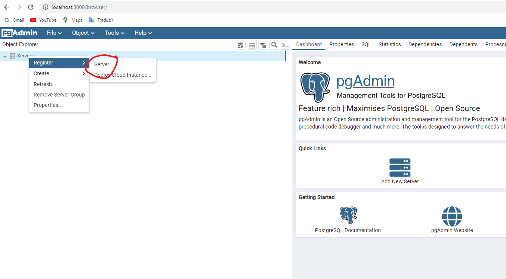
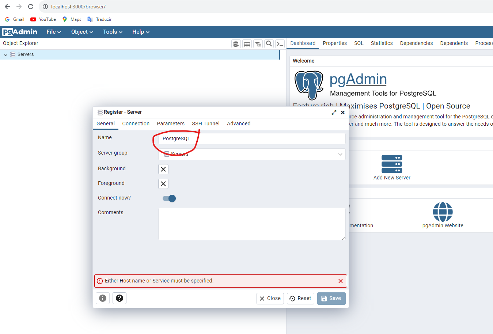
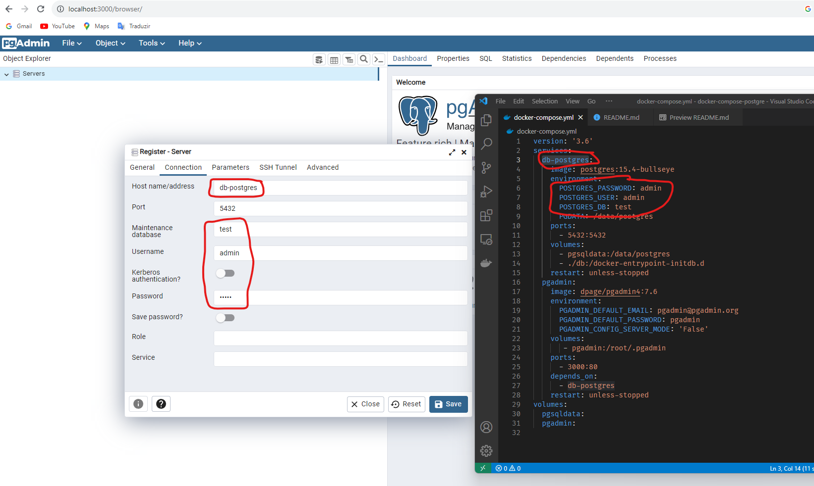
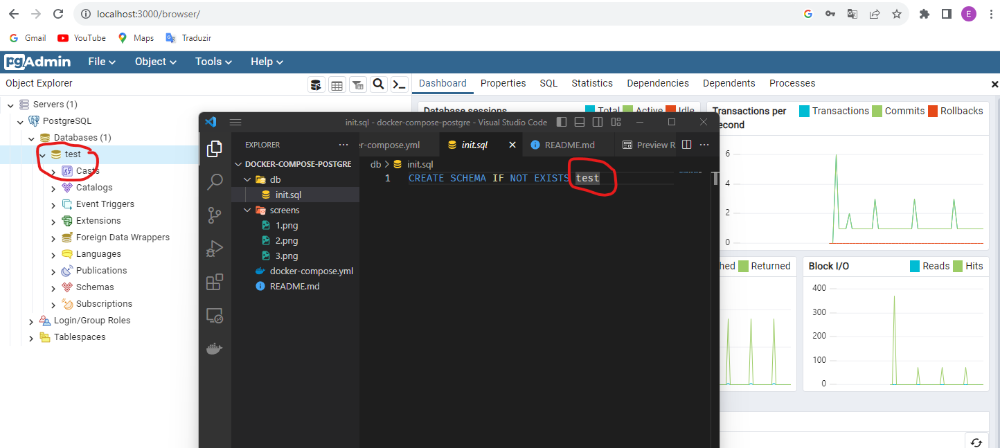

# Docker Compose 
## for PostgreSQL 15.4 and PgAdmin 7.6

### Run command for start server
In folder the docker-compose.yml
```
docker compose up -d
```

### Run command for stop server
In folder the docker-compose.yml
```
docker compose down
```
---

### Steps for configuration PGADMIN 7.6 in http://localhost:3000

---
### Step 1
Create a server


### Step 2
Register name server


### Step 3
Configure connection with name database, user and password  


### Step 4
Running database successfully and name can be changed in init.sql file  

